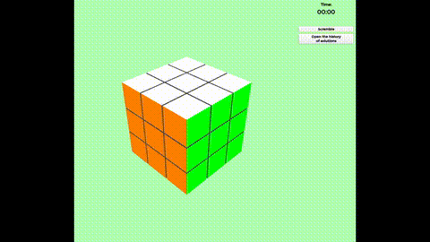

# Rubik's Cube

Кубик Рубика 3D на Qt6 с OpenGL.



## Сборка

```bash
qmake6 RubiksCube.pro
make -j$(nproc)
```

## Управление

**Клавиши** (без Shift — по часовой, с Shift — против):

| Клавиша | Грань |
|---|---|
| W / Shift+W | U / U' (верх) |
| S / Shift+S | D / D' (низ) |
| A / Shift+A | L / L' (левая) |
| D / Shift+D | R / R' (правая) |
| E / Shift+E | F / F' (фронт) |
| Q / Shift+Q | B / B' (тыл) |

**ПКМ + движение** — вращение сцены.

## Зависимости

- Qt6 (Core, Gui, OpenGL, OpenGLWidgets, Widgets)
- OpenGL
- C++17
